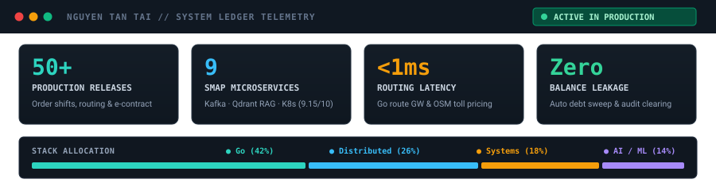
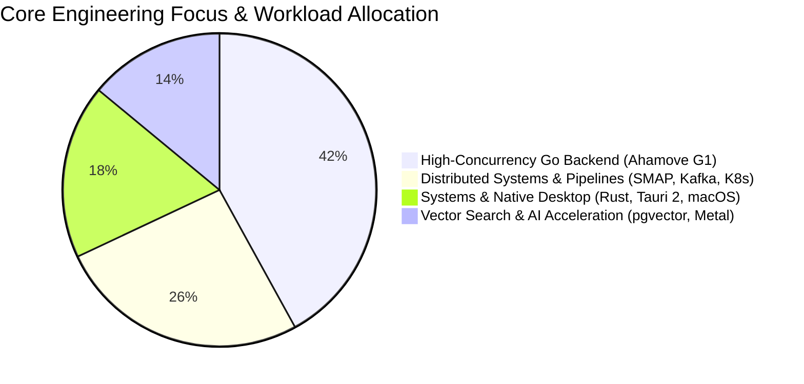
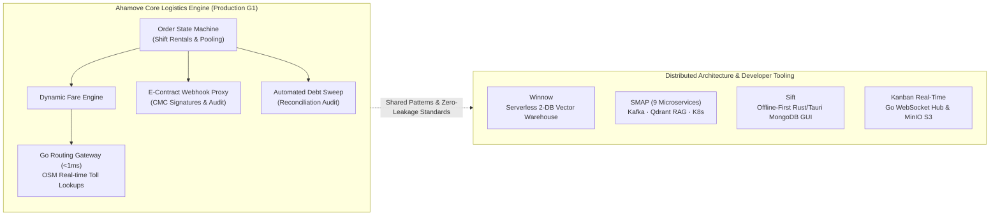

# Hi there! I'm Nguyễn Tấn Tài 👋

**Software Engineer at Ahamove (Level G1) | Distributed Systems | Cloud-Native Backend | Systems Engineering**

---

## ⚡ Executive Summary

I am a **Software Engineer at Ahamove (Level G1)** with extensive hands-on experience designing, operating, and hardening **high-concurrency Golang microservices**, event-driven pipelines, and cloud-native infrastructure in production.

Beyond core logistics backend delivery, I architect **distributed systems, developer tools, and infrastructure automation** — spanning serverless vector warehouses on **Cloudflare Workers & pgvector**, offline-first desktop systems in **Rust & Tauri 2**, real-time concurrent WebSocket hubs in **Go**, and automated bare-metal **Kubernetes homelab** virtualization managed via Terraform & Ansible.

Explore the interactive portfolio at [**tantai.dev**](https://tantai.dev) featuring dynamic full-view-height stages (`100dvh`), deep-dive system architecture inspection modals, and production engineering ledgers.

---

## 📊 Production Engineering Telemetry

| Metric | Area | Production Significance |
| :--- | :--- | :--- |
| **50+** | **Production Releases** | Order lifecycle, truck shifts, e-contracts, and routing deployed to Ahamove nationwide fleet |
| **9** | **SMAP Microservices** | Event-driven social analytics, NLP enrichment, and Qdrant RAG vector pipeline (Thesis: 9.15/10) |
| **<1ms** | **Routing Latency** | High-throughput Go evaluation & real-time OpenStreetMap (OSM) toll calculation |
| **Zero** | **Balance Leakage** | Automated driver debt sweeping & decoupled reimbursement reconciliation audits |

---

## 📈 Engineering Domain & Workload Allocation

---

## 🗺️ Systems Architecture & Service Topology

---

## 🚀 Featured Engineering Projects

### 1. [Winnow](https://github.com/nguyentantai21042004/winnow) — Distributed Technical Reading Warehouse
_Automated pipeline that continuously monitors, deduplicates, vectorizes, and surfaces top-tier engineering papers & research blogs._
- **Tech Stack:** Cloudflare Workers (TypeScript / Hono), Cloudflare Queues, Neon Postgres (`pgvector`), Python (extract service), arXiv LaTeX/HTML parsing.
- **Key Highlights:**
  - **Two-Database Boundary:** Decoupled transactional truth (CORE: 25 relational tables) from vector similarity embeddings (VECTOR: `pgvector` k-NN and citation graphs).
  - **Event-Driven Ingest:** Queue-backed ingestion, automatic scoring and deduplication, and isolated Python full-text extraction service running in CI/local.

### 2. [SMAP](https://github.com/smap-hcmut/report) — Distributed Social Media Analytics Platform
_Graduation Capstone Project at HCMUT (Defended June 2026 with high honors · Grade: 9.15/10)._
- **Tech Stack:** Golang (Gin), Python (FastAPI), Kafka, RabbitMQ, Redis, PostgreSQL, MongoDB, MinIO, Qdrant Vector DB, Kubernetes.
- **Key Highlights:**
  - **9 Domain Microservices:** Isolated services for identity, crawl ingest, NLP enrichment, vector knowledge retrieval (RAG), notifications, and reporting.
  - **Production Resiliency:** Multi-tenant RBAC, cross-project comment deduplication, Prometheus RED metrics instrumentation, and zero-downtime deployment on homelab K8s.

### 3. [Caption Flow](https://github.com/nguyentantai21042004/caption-flow) — Apple Silicon Video Subtitle & AI Summary Engine
_Hardware-accelerated video intelligence pipeline built specifically for macOS Apple Silicon._
- **Tech Stack:** Golang, FFmpeg (VideoToolbox hardware acceleration), `whisper.cpp` (Metal GPU), DeepSeek API, Gemini API fallback.
- **Key Highlights:**
  - Fast transcription and burned subtitles processing at **under 0.3x realtime** on Apple M-Series GPUs.
  - Fault-tolerant AI summarization pipeline with dynamic API key rotation, exponential backoff, and formatted Vietnamese DOCX export.

### 4. [Homelab IaC](https://github.com/nguyentantai21042004/homelab-iac) & [On-Premise Architecture](https://github.com/nguyentantai21042004/onprem-document)
_Production-grade bare-metal virtualization and cluster orchestration._
- **Tech Stack:** VMware ESXi, Terraform, Ansible, Kubernetes, pfSense, WireGuard, Harbor, MinIO.
- **Key Highlights:**
  - Fully automated VM provisioning on bare-metal ESXi using Terraform instead of ClickOps.
  - Automated K8s cluster bootstrapping and ingress/storage provisioning via idempotent Ansible Playbooks.

### 5. [Sift](https://github.com/nguyentantai21042004/sift) — Offline-First Native Desktop MongoDB GUI
_Fast, zero-telemetry native desktop MongoDB management tool without vendor lock-in or tracking._
- **Tech Stack:** Rust, Tauri 2, React, TypeScript, Monaco Editor, Tailwind CSS.
- **Key Highlights:**
  - **Zero Telemetry & Local Execution:** Native Rust backend with zero external analytics, 100% air-gapped ready.
  - **Query Workbench & Visual Explain Plan:** Monaco aggregation query editor, visual explain plan stage tree, and built-in SSH bastion tunneling.

### 6. [Kanban Real-Time](https://github.com/nguyentantai21042004/kanban) — Collaborative Task Management Engine
_High-throughput WebSocket collaborative project management engine with atomic conflict resolution._
- **Tech Stack:** Golang, WebSockets, Next.js 14, MinIO S3, PostgreSQL 16.
- **Key Highlights:**
  - **WebSocket Hub Fanout:** Go WebSocket hub broadcasting real-time card moves across hundreds of concurrent clients with zero data race hazards.
  - **Optimistic Reconciliation:** Client-side optimistic UI reordering with automated server-authoritative rollback on conflict or partition.
  - **Direct Object Storage:** MinIO S3 presigned URL direct uploads preventing server memory buffering.

---

## 💼 Professional Experience

### Software Engineer | Ahamove (Level G1)
_Feb 2026 – Present | Ho Chi Minh City, Vietnam_

Delivered core backend infrastructure across order dispatching, electronic contracting, partner portals, and financial reconciliation in a high-scale logistics network serving millions of transactions.

- **Truck Rental Shifts & Dedicated Fleet Booking (`order` service):**
  - *Business Value:* Transitioned logistics from traditional per-trip dispatch to flexible block-based vehicle hiring (bundles of hours and kilometers), unlocking a recurring B2B corporate logistics revenue stream.
  - *Engineering Architecture:* Designed high-volume state machines handling shift lifecycles, checkpoint visual evidence validation, and automated odometer overage fare calculations.
- **Fleet Utilization & Cancellation Protection (`order` service):**
  - *Business Value:* Prevented vehicle deadhead miles and preserved driver earnings during multi-stop pooling orders.
  - *Engineering Architecture:* Engineered intelligent cancellation restriction windows during order pooling and assignment phases, ensuring consistent fleet availability.
- **Electronic Contracting & Paperless Onboarding (`econtract` & `webhooks` services):**
  - *Business Value:* Slashed driver and enterprise merchant onboarding turnaround from days to minutes by digitizing paper agreements.
  - *Engineering Architecture:* Built a greenfield contract generation service supporting dynamic legal templates for Household Businesses (Hộ Kinh Doanh) and Enterprises; engineered a secure webhook proxy architecture verifying digital signature (CMC) callbacks, writing immutable audit trails, and managing contract renewals.
- **High-Throughput Routing Gateway & Toll Calculations (`routing-gw`, `route-optimization`):**
  - *Business Value:* Eliminated fare estimation discrepancies and reduced trip calculation costs across national expressway routes.
  - *Engineering Architecture:* Migrated legacy routing endpoints to Golang for sub-millisecond route evaluations; integrated OpenStreetMap (OSM) toll booths and ferry pricing directly into real-time fare computation.
- **Franchise Fleet Management & Observability (`fleet-management-portal`, `business-portal`):**
  - *Business Value:* Enabled franchise fleet owners to independently manage multi-driver fleets and inspect financial credit health without platform support overhead.
  - *Engineering Architecture:* Architected internal domain smart routing and server-to-server (S2S) debt query endpoints; instrumented user telemetry via PostHog for behavioral product analytics.
- **Financial Reconciliation & Debt Clearing (`payment` service):**
  - *Business Value:* Prevented credit leakage and streamlined accounting audits across multi-tier vendor partnerships.
  - *Engineering Architecture:* Isolated driver reimbursement payouts from standard order billing and implemented an automated debt sweeping mechanism.

---

### Backend Developer (Part-time) | ROBO-HI VIET NAM (ZMP Inc.)
_Oct 2025 – Dec 2025 | Tokyo, JP (Remote)_

- Built communication infrastructure between cloud command dispatchers and autonomous robot fleets on AWS.
- Improved `MQTTConnection` pooling architecture in Node.js/TypeScript to support concurrent multi-robot fleets and command queues.
- Researched ROS 2 (Humble) and ROS 1 DDS communication layers as high-throughput, low-latency replacements to Redis Pub/Sub for robot telemetry.
- Contributed to distributed fleet command dispatching workflows for multi-type robot fleets.

---

### Backend Developer (Part-time) | TANCA.,JSC
_Aug 2024 – Sep 2025 | Ho Chi Minh City, Vietnam_

- Developed high-volume Golang (Gin) microservices for an enterprise Human Resource Management (HRM) platform.
- Implemented multi-tier Talent Management evaluation workflows and automated career matrix generation.
- Built customized ETL and CSV data export pipelines for enterprise clients including Xi Măng Hạ Long and Decathlon.
- Built cross-system middleware validating subscription package feature permissions and user quotas.

---

## 🛠️ Technical Repertoire

| Domain | Technologies & Frameworks |
| :--- | :--- |
| **Languages** | **Golang** (Advanced), **Rust**, **TypeScript / JavaScript**, **Python**, C++, SQL |
| **Backend & APIs** | **Gin**, FastAPI, Node.js, Hono, Next.js, REST, gRPC, WebSockets, JSON-RPC |
| **Low-Level & Systems** | **macOS DriverKit**, IOKit, HID++ protocol, `CGEventTap`, POSIX, Launchd / Systemd |
| **Databases & Stores** | **PostgreSQL**, **pgvector**, MongoDB, Redis, Qdrant (Vector DB), SQLite (WAL), MinIO |
| **Message Queues** | **Kafka**, **RabbitMQ**, Cloudflare Queues, Redis Streams / PubSub, MQTT |
| **Cloud & Infra** | **Kubernetes**, **Docker**, **Terraform**, **Ansible**, Cloudflare Workers, AWS (EC2, S3, IAM, VPC), VMware ESXi |
| **Observability & Tools** | Prometheus, Grafana, PostHog, Jenkins, Rancher, Git / GitHub / GitLab, pfSense |

---

## 🎓 Education & Certifications

- **Ho Chi Minh City University of Technology (HCMUT - ĐHQG-HCM)**
  - *Bachelor of Engineering in Computer Science* (Sep 2022 – May 2026)
  - Capstone: SMAP Distributed Analytics Platform (Defended June 2026 · Grade: **9.15 / 10**)
- **English Proficiency:** TOEIC **847**

---

**Let's build reliable systems together.**

